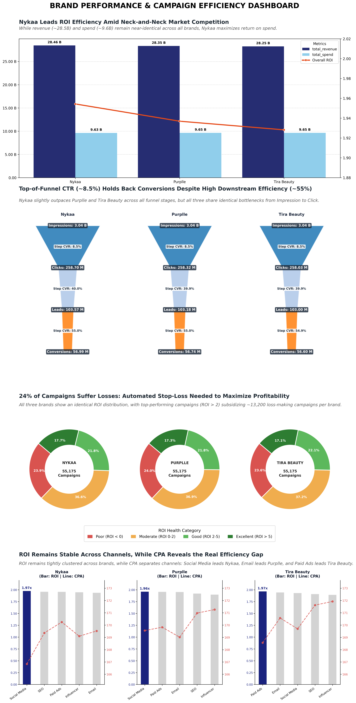

# Indian Beauty Shop - Marketing Analytics & Executive Dashboard

An end-to-end marketing analytics system designed for a cosmetics and beauty retail network. The pipeline automatically extracts data from MySQL, computes core business performance metrics (Revenue, Spend, Profit, ROI, Conversion Funnel), and generates a publication-ready **Executive Dashboard** following data storytelling principles using Python and Matplotlib.

---

## 📌 Overview

**Status:** This repository currently features the **Descriptive & Diagnostic Analytics Suites (Phases 1 & 2)**. The project is actively evolving toward **Prescriptive & Predictive Marketing Analytics**, focusing on automated risk controls and ML-driven campaign forecasting.

### 📊 Current Features

The interactive dashboard suite delivers an end-to-end diagnosis of marketing efficiency across system-wide metrics and individual brand dynamics:

- **Executive Overview Dashboard (Phase 1):** Monitors macro-level financial health, monthly revenue trends, system-wide conversion bottlenecks (~8.5% CTR), and extreme performance outliers ($60\text{--}79\text{x}$ ROI drivers vs. $-0.99\text{x}$ capital sinks).
- **Brand Benchmarking & Channel Efficiency (Phase 2):** Compares cross-brand performance (Nykaa, Purplle, Tira Beauty), pinpoints brand-specific funnel leakage, and identifies cost-effective acquisition drivers by analyzing Channel CPA vs. Weighted ROI.

### 🚀 What's Next & Upcoming Roadmap

To transform descriptive insights into proactive business decision-making, upcoming developments will focus on:

- **Machine Learning Risk Prediction Model:** Developing classification models (e.g., Random Forest, XGBoost) trained on historical campaign parameters to predict high-risk, loss-making campaigns ($ROI < 0$) *prior to budget commitment*.
- **Prescriptive Action & Budget Optimization Engine:** Simulating financial uplift through automated stop-loss guardrails and algorithmic budget reallocation toward high-performing channels.
- **Automated Data Pipeline & Alerting:** Building automated ETL routines and alert mechanisms to trigger campaign pauses when performance dips below critical thresholds.

---

## 💡 Key Business Insights & Data Story

### Business Overview


<p align="center">
  <em>Overview Dashboard</em>
</p>

#### 1. Macro Stability: Predictable Profitability Across the Network

At the macro level, the business model demonstrates exceptional stability. Generating **$85.1B in Total Revenue** against **$28.9B in Total Spend**, the network secures a solid **$56.1B Net Profit** with a **Weighted ROI of 1.94x**.

Monthly spend remained strictly controlled at ~**$2.5B/month** over an 11-month period, reliably producing a steady **~66% profit margin** (~**$5.0B net profit monthly**).

> **Contextual Note:** The sharp decline observed in June 2025 reflects an incomplete data cut-off period (recorded up to June 24), rather than a fundamental decay in underlying business performance.

#### 2. The Conversion Dynamics: A Tale of Two Funnels

Analyzing the system-wide conversion funnel (handling **9.1B Impressions** down to **170.3M Conversions**) reveals a clear operational paradox:

- **The Downstream Powerhouse:** Once users enter the lead stage, execution is remarkably strong. The system achieves a **~40% Click-to-Lead CVR** and an extraordinary **~55% Lead-to-Conversion CVR** (overall Click-to-Conversion stands at 21.98%).
- **The Top-of-Funnel Leakage:** The primary efficiency bottleneck occurs at the very top stage, where the **Click-Through Rate (CTR) chokes at 8.50%**.

> **Insight:** Post-click engagement, landing page conversion, and sales checkouts are highly optimized. Growth is hindered by top-of-funnel ad creative fatigue and initial targeting resonance.

#### 3. Sunk Capital & Profit Erosion: The 23.8% Loss Rate

A portfolio analysis of **165,525 campaigns** reveals a dangerous structural inefficiency hidden beneath strong overall net margins:

- **76.2% of campaigns are profitable**, but **23.8% (~39,400+ campaigns) operate at a direct financial loss ($ROI < 0$)**.
- **Extreme Outlier Asymmetry:** System profitability is heavily reliant on a small fraction of "outlier" campaigns. The **Top 10 High-Performing Campaigns** generate massive returns with **ROI ratios between 60.9x and 79.3x**. Conversely, the **Bottom 10 Underperforming Campaigns** suffer near-total capital destruction with **ROI ratios reaching -0.96x to -0.99x**.

> **Insight:** Top-tier campaigns are carrying the financial weight of thousands of unmonitored, loss-making campaigns that erode total net profit every month.

#### 🎯 Strategic Recommendations & Executive Roadmap

1. **Implement Automated Campaign Stop-Loss Triggers:** Establish real-time guardrails to automatically pause or cap budget when a campaign dips below $ROI = -0.50$ (or $ROI < 0$). Cutting the 23.8% loss-making tail will instantly expand system-wide net profit margins.
2. **Replicate Winning Attributes from Outlier Campaigns:** Conduct a feature attribution analysis on the Top 10 Campaigns ($60\text{--}79\text{x}$ ROI) to isolate high-performing attributes—such as messaging frameworks, audience segments, or launch timing—and scale them across the network.
3. **Refocus Optimization on Top-Funnel Creatives:** Divert optimization budget away from post-click/checkout steps (which already operate at an optimal ~55% CVR) and reinvest into aggressive A/B testing for ad creatives to lift initial CTR beyond the **8.5% bottleneck**.

### Brand Comparison


<p align="center">
  <em>Brand Performance & Channel Breakdown</em>
</p>

#### 1. The Macro Picture: A High-Stakes, Neck-and-Neck Race

The cosmetics and beauty retail landscape is currently defined by a tight contest among three key players: **Nykaa, Purplle, and Tira Beauty**. Operating on near-identical budget allocations (~**$9.65B** each) and generating comparable total revenues (~**$28.2B – $28.4B**), **Nykaa** slightly edges out the competition in capital efficiency with a **Weighted ROI of 1.96x** (compared to Purplle's 1.94x and Tira's 1.93x).

However, this narrow margin indicates that all three brands operate under nearly identical structural mechanics—meaning future breakthroughs will depend heavily on granular operational optimizations.

#### 2. The Universal Bottleneck: Top-of-Funnel Leakage

A deep dive into the conversion funnels across all three brands reveals a striking, system-wide behavior:

- **High Downstream Efficiency:** All three brands demonstrate strong bottom-funnel execution, maintaining an impressive **~55% Lead-to-Conversion CVR** and an **~40% Click-to-Lead CVR**.
- **Top-of-Funnel Bottleneck:** The primary friction occurs at the initial engagement stage, where the Click-Through Rate (**CTR**) drops sharply to **~8.5%** (narrowing 3.04 Billion Impressions down to 258 Million Clicks).

> **Insight:** The business does not suffer from brand trust or checkout conversion issues. The main constraint lies in **ad creative performance and initial audience capture at the top of the funnel**.

#### 3. The Hidden Erosion: 24% Unprofitable Campaigns

Analyzing ROI health distribution across all ~165,000 campaigns (~55,175 campaigns per brand) highlights why overall net profitability remains capped:

- **Nearly 24% of all campaigns (~13,200 campaigns per brand) operate at a net financial loss ($ROI < 0$).**
- This capital erosion is currently being masked and subsidized by the top 17.5% of high-performing campaigns ($ROI > 5$).

> **Insight:** Maintaining unprofitable campaigns passively erodes overall net margins. Implementing active loss-control mechanisms will yield immediate financial lift.

#### 4. The Real Differentiator: CPA Divergence Across Channels

While average ROI remains tightly clustered across channels (~1.90x to 1.97x), **Cost Per Acquisition (CPA)** reveals distinct channel efficiencies unique to each brand:

- **Nykaa:** Achieves maximum cost efficiency through **Social Media** (lowest CPA at ~$166.5 with a peak 1.97x ROI).
- **Purplle:** Scales most efficiently via **Email Marketing** (lowest CPA at ~$169).
- **Tira Beauty:** Unlocks its best acquisition economics through **Paid Ads** (lowest CPA at ~$168.5).

#### 🎯 Strategic Recommendations & Action Plan

1. **Deploy Automated Stop-Loss Rules:** Implement automated triggers to pause any campaign falling below $ROI = 0$. Eliminating the bottom 24% loss-making campaigns will instantly expand net profit margins without increasing total spend.
2. **Revamp Top-of-Funnel Creatives:** Focus A/B testing on ad creatives and hook messaging to elevate CTR from **8.5% to 11–12%**. Given the robust ~55% downstream conversion rates, a minor lift in top-funnel clicks will multiply total conversions significantly.
3. **Reallocate Capital by Channel Dominance:**
   - Scale budget allocation toward **Social Media** for Nykaa.
   - Expand **Email Marketing** automation workflows for Purplle.
   - Double down on targeted **Paid Ads** campaigns for Tira Beauty.

---

## 🛠️ Technology Used

| Component | Tool / Library | Primary Role |
| :--- | :--- | :--- |
| **Language** | Python 3.10+ | Core pipeline orchestration & automated report generation |
| **Database** | MySQL | Centralized marketing analytics data store |
| **Data Transformation** | dbt (data build tool) | Data modeling, staging layer construction, and business logic transformations (ELT) |
| **Database Connectivity** | PyMySQL, SQLAlchemy | Database connection management and SQL execution |
| **Data Processing** | Pandas, NumPy | In-memory data aggregation, metric calculations, and dataset formatting |
| **Data Visualization** | Matplotlib, GridSpec | Custom executive dashboard rendering, layout orchestration, and visual styling |

---

## 🚀 Quick Start

### 1. Prerequisites
Ensure you have the following installed on your machine:
* Python `>= 3.10`
* A running MySQL instance with the `marketing_analytics` database loaded.

### 2. Installation & Setup

Clone the repository and navigate to the project root:

```bash
git clone [https://github.com/your-username/Indian_Beauty_Shop_Marketing_Analytics.git](https://github.com/ntq05/Indian_Beauty_Shop_Marketing_Analytics.git)

cd Indian_Beauty_Shop_Marketing_Analytics

conda create --prefix ./env python=3.10

conda activate ./env

cd Indian_Beauty_Shop_Marketing_Analytics

pip install -r requirments.txt
```