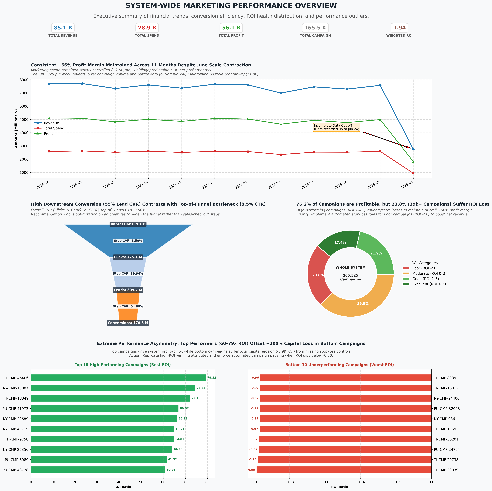

# Indian Beauty Shop - Marketing Analytics & Executive Dashboard

An end-to-end marketing analytics system designed for a cosmetics and beauty retail network. The pipeline automatically extracts data from MySQL, computes core business performance metrics (Revenue, Spend, Profit, ROI, Conversion Funnel), and generates a publication-ready **Executive Dashboard** following data storytelling principles using Python and Matplotlib.

---

## 📌 Overview

> **Note:** This repository currently features the **Executive Overview Dashboard (Phase 1)**. The project is actively evolving to include deeper predictive modeling, automated workflow pipelines, and advanced marketing analytics modules.

Currently, the primary dashboard module delivers a high-level overview of marketing efficiency across the business network:

* **KPI Summary Cards:** Executive metrics tracking Revenue, Spend, Profit, Total Campaigns, and Weighted ROI.
* **Financial Trend Analysis:** Monthly performance tracking of Revenue, Spend, and Profit Margins over time.
* **Conversion Funnel & ROI Health:** Funnel conversion efficiency alongside campaign profitability categorization.
* **Top & Bottom Performers:** Identification of high-ROI drivers vs. severe capital loss campaigns to guide automated stop-loss policies.



---

## 🛠️ Technology Used

| Component | Tool / Library | Primary Role |
| :--- | :--- | :--- |
| **Language** | Python 3.10+ | Core pipeline orchestration & automated report generation |
| **Database** | MySQL | Centralized marketing analytics data store |
| **Data Transformation** | dbt (data build tool) | Data modeling, staging layer construction, and business logic transformations (ELT) |
| **Database Connectivity** | PyMySQL, SQLAlchemy | Database connection management and SQL execution |
| **Data Processing** | Pandas, NumPy | In-memory data aggregation, metric calculations, and dataset formatting |
| **Data Visualization** | Matplotlib, GridSpec | Custom executive dashboard rendering, layout orchestration, and visual styling |

---

## 🚀 Quick Start

### 1. Prerequisites
Ensure you have the following installed on your machine:
* Python `>= 3.10`
* A running MySQL instance with the `marketing_analytics` database loaded.

### 2. Installation & Setup

Clone the repository and navigate to the project root:

```bash
git clone [https://github.com/your-username/Indian_Beauty_Shop_Marketing_Analytics.git](https://github.com/ntq05/Indian_Beauty_Shop_Marketing_Analytics.git)

cd Indian_Beauty_Shop_Marketing_Analytics

conda create --prefix ./env python=3.10

conda activate ./env

cd Indian_Beauty_Shop_Marketing_Analytics

pip install -r requirments.txt
```